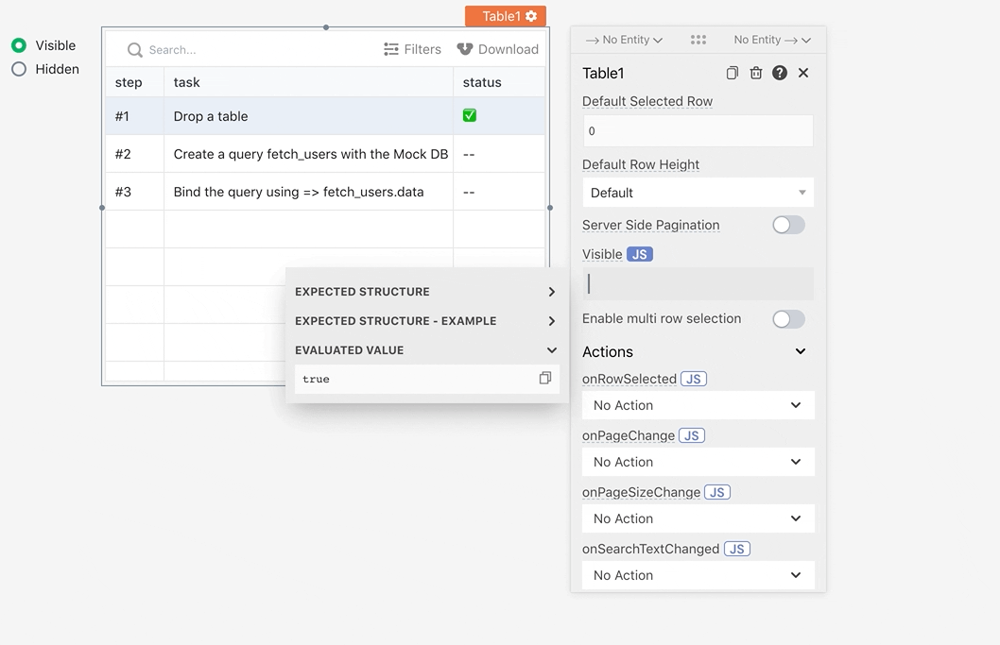
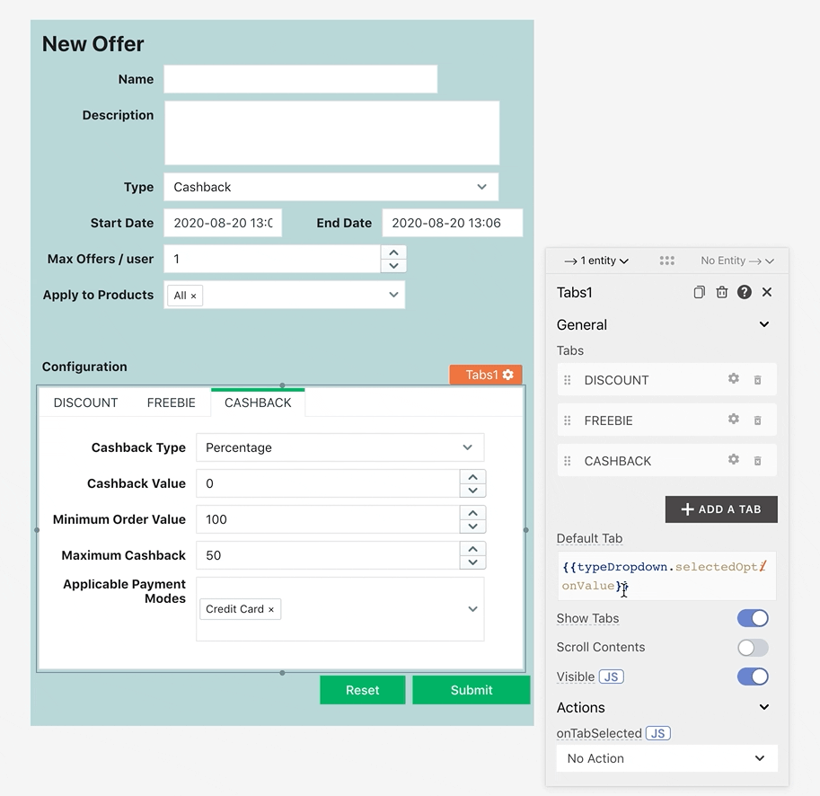

# 控制小部件的可见性

可见性属性通常是每个小部件的属性窗格中的一个开关。通过单击将其转换为文本字段的属性旁边的 JS 按钮，可以使该属性成为动态的。在文本内部，可见性的值可以使用 javascript 有条件地设置。

## 使用其他小部件控制可见性

在下面的示例中，表格的可见性是基于 RadioGroup 的选定值的条件值

```
// {{RadioGroup1.selectedOptionValue === "Visible"}}
```

> Visible 属性要求表达式计算为布尔值



## 使用查询响应控制可见性

与上面的示例类似，我们可以将小部件的可见性与查询的响应联系起来。

```
// {{ API1.data.value === "trueValue" }}
```

## 动态表格

在某些情况下，表单字段需要根据用户输入动态更改。这可以使用表单内的 Tab 小部件并根据表单的输入有条件地更新选定的选项卡值来实现



> 隐藏选项卡小部件中的选项卡，使其看起来像视图正在原地更改
