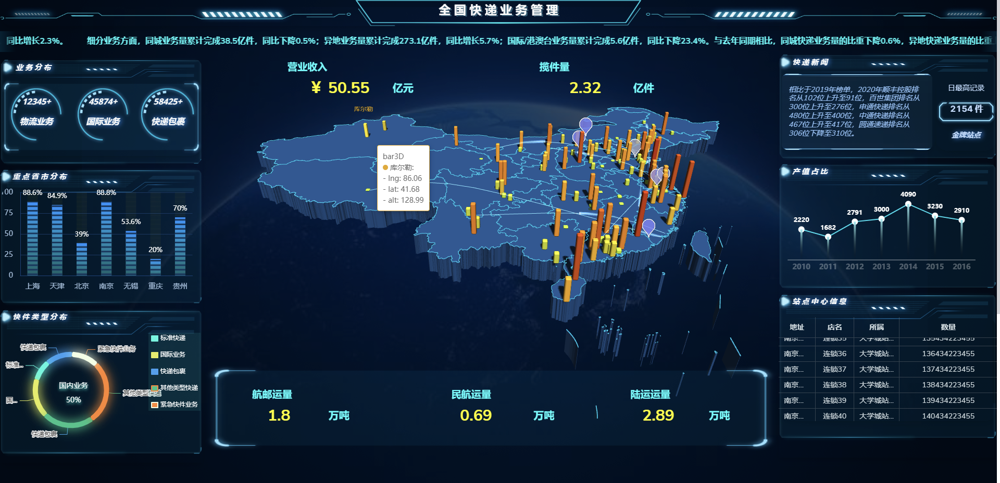

# 版本日志

## 社区版

### 2023.7.31


**V1.9.20版本镜像已更新**


#### 1、功能变化

* 优化了页面首次加载的时间，页面加载变得更快了
* 优化了PagePlug页面加载时的页面显示及动画，不再报503和404错误了🙅‍♂️

<figure><figcaption></figcaption></figure>

* 在数据源配置中添加了文件 ID 映射
* 增加同步字段的异步函数中的Linted警告提醒

<figure><figcaption></figcaption></figure>

* 数据源支持Oracle，添加对数据库模式的支持
* 优化了Table组件分页在右上角显示、页面纪录算法的问题

<figure><figcaption></figcaption></figure>

* 添加组件响应能力和转化的算法
* 添加了 forkWithConfiguration 字段，用于工作区复制应用时是否共享数据源
* 重构了配置组件事件的UI交互

<figure><figcaption></figcaption></figure>

* 优化了组件名称序号从低到高排列的展示
* 在sql编辑器里面，新增提示补全功能，编写查询更快了

<figure><figcaption></figcaption></figure>

* 新增cron任务清理超过应用程序7天的日志，避免占用大量磁盘空间
* 优化了新用户体验的教程

<figure><figcaption></figcaption></figure>

* 在编辑器中支持对Tabs健来完成提示
* PP支持访问 Google Sheets 数据源中特定工作表的权限
* 按钮组件、图标按钮组件新增气泡提醒

<figure><figcaption></figcaption></figure>

* 导航栏进行重构，菜单栏支持更多层级的设计，支持收缩展示

<figure><figcaption></figcaption></figure>

<figure><figcaption></figcaption></figure>

#### 2、Bug修复

1. 修复旧版mongo需要带有AVX指令的CPU问题
2. 修复了弹窗中嵌套列表组件时页面无响应的问题
3. 修复了formily组件颜色主题问题
4. 修复了REST 和 GRAPHQL填写API URL时有空格的错误修复
5. 修复了MongoDB无效数据库名称提示连接正常问题
6. 修复了在同步字段内使用异步字段出现新的有用的错误消息。
7. 修复了在git同步模式时，应用包含空查询时会显示未提交的更改
8. 修复了下载图像文件名包含（）时损坏的问题
9. 修复了在客户端文件上传过大报413错误的问题
10. 修复了页面错误发生或崩溃时，通过浏览器按钮导航清除错误状态
11. 修复了表格组件列类型为选择器时，新增一行无法显示相同内容的问题
12. 修复了标签页组件中若组件设置了标签页默认值切换的问题
13. 修复了数据库默认创建sql双nameInput.text的问题
14. 修复了表格组件和手机号输入组件之前进行空检查
15. 修复了Promise上解析api.data的问题
16. 修复了appsmith一些漏洞安全问题
17. 修复Table组件框内文本无法复制的问题

### 2023.3.21&#x20;


**V1.9.10版本镜像已更新**


#### **1、新增功能🏅**

* 支持引入第三方JS库


1、可以将你需要工具库的URL 粘贴到Pageplug中来使用

2、可以在资源管理器中查看所有已安装的库。


<figure><figcaption></figcaption></figure>

* #### &#x20;新增iframe嵌入选项


1、添加用于嵌入 iframe 的代码片段

2、`ssoTrigger`结合使用查询参数对程序借用信任`embed=true`

`3、`登录嵌入应用程序的用户现在可以自动看到PagePlug 应用程序


<figure><figcaption></figcaption></figure>

* **新增数据查看层**


目前仅适用于api.data


<figure><figcaption></figcaption></figure>

* **新增值查看窗口**


1、只有在组件中有代码或输入存在验证错误时，它才会显示

2、窗口支持拖拽，放在你喜欢的任意位置

3、窗格的默认状态更加清晰，带有扩展部分的选项


<figure><figcaption></figcaption></figure>

#### 2、功能优化💪

* 底层升级：

mongo 4.4 -> 5.0.14

&#x20;jdk 11 -> 17&#x20;

Spring Boot 2.7 -> 3.0.1 3

* ANTD5升级，让 formily 支持设置主题，整体样式方案更统一✅
* 嵌入个人的应用程序中提供 SSO，自动高度改进等
* `storeValue`操作现在被批处理以获得更好的性能
* 容器现在会随着其中组件的大小自动增长和收缩。当你拖动其他组件上下移动时，容器还会实时更改大小
* 查询字段、输入和数字输入可以响应了
* 引用一个类似实体`selectedTab`或在 JavaScript 函数中声明的另一个属性，其名称是计算的，而不是静态的，不会再抛出错误的 linting 错误
* 商业版ODIC功能优化，修复 OIDC 对 Spring、AWS Cognito 的依赖性

#### 3、修复已知bug🐮

* 对gitee、github上的issue问题进行优化处理，欢迎继续在社区提交issue
* 修复用户的浏览器导航问题，可以使用浏览器后退/前进按钮在 PagePlug上穿越旧环境
* 修复表格在添加绑定到列名称时中断的问题
* 修复列表组件嵌套限制为最多 3 层
* 修复在 API 标头中包含与换行符的绑定
* 修复在任何 JS 对象中引用其中任何一个时，会自动完成现在会显示所有 JS 对象的所有函数。
* 修复商业版用户现在将在注册并激活他们的实例后看到他们应该看到的应用程序，而不必从主屏幕上找出他们想要的应用程序
* 将 Nginx 限制增加到 150 MB 以允许 100 MB Base 64 编码文件
* 修复允许 MsSQL 插件连接 ssl 加密

欢迎社区的同学们在gitee及github上对pageplug的使用给我们提issue哈🥳

## 企业版

### 2023.7.31

#### 1、功能变化

* 新增画布自定义功能，可以根据业务场景自定义画布尺寸大小

<figure><figcaption></figcaption></figure>

* 审计日志新增DataSource相关事件（Create、update、deleted），事故回溯和解决方案更加高效了

<figure><figcaption></figcaption></figure>

* 大屏组件上新，新增时钟、标题、轮播表、水球、进度池组件，大屏功能开发更多样了

<figure><figcaption></figcaption></figure>

#### 2、Bug修复

1. 修复了单点登陆OIDC空状态下Client ID可用的问题
2. 修复了审计日志使用一段时间后显示空白无法搜索的问题
