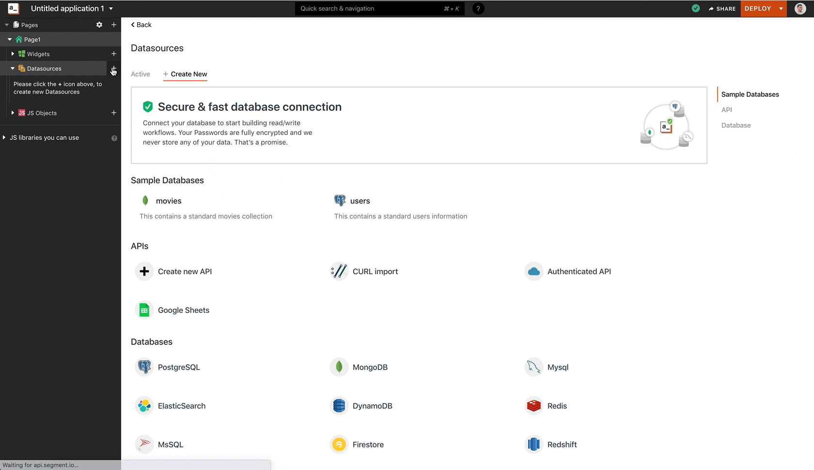

# 连接到数据源

丰富的应用程序需要真实数据来构建直观的 UI、执行数据转换和编写业务正确的逻辑.Appsmith 可以通过以下方式与您的数据对话

* [直接查询您的数据库](https://docs.appsmith.com/core-concepts/connecting-to-data-sources/connecting-to-databases)
* [点击 REST API](https://docs.appsmith.com/core-concepts/connecting-to-data-sources/authentication)

> 在连接到数据源之前,您必须将 Appsmith 部署在您的数据库实例或 VPC 上的 IP 地址列入白名单
>
> **18.223.74.85** 和 **3.131.104.27** 是需要加入白名单的Appsmith云实例的IP地址
>
> 这是有关如何 [在 AWS 上将 appsmith 列入白名单的指南.](https://docs.appsmith.com/learning-and-resources/how-to-guides/aws-whitelist)

### 安全 <a href="#e5-ae-89-e5-85-a8" id="e5-ae-89-e5-85-a8"></a>

Appsmith 安全地加密您的所有数据源凭据并安全地存储它们.Appsmith 也不存储从您的数据源返回的任何数据,并且仅充当代理层来协调查询的执行.由于 Appsmith 是一个开源框架,您可以 [将其部署在本地](https://docs.appsmith.com/getting-started/setup), 并对其进行审核以确保您的所有数据都不会离开您的 VPC.

阅读有关 [安全性](https://file+.vscode-resource.vscode-cdn.net/Users/fengqiong/Desktop/security.md) 的更多信息

### 样本数据 <a href="#e6-a0-b7-e6-9c-ac-e6-95-b0-e6-8d-ae" id="e6-a0-b7-e6-9c-ac-e6-95-b0-e6-8d-ae"></a>

如果您想在连接数据之前使用该平台,我们提供您可以使用的模拟数据源.

#### 示例数据库 <a href="#e7-a4-ba-e4-be-8b-e6-95-b0-e6-8d-ae-e5-ba-93" id="e7-a4-ba-e4-be-8b-e6-95-b0-e6-8d-ae-e5-ba-93"></a>

您可以连接到 2 个示例数据集

1. Movies: 这是一个示例 mongoDb 数据库,其中包含一个名为 movies 的集合
2. Users: 这是一个示例 PostgreSQL 数据库,其中包含一个名为 users 的表

模拟数据库中的数据每 24 小时重置一次,并且对所有用户都是通用的,因此它可能包含一些意外值的表.



#### 示例 API <a href="#e7-a4-ba-e4-be-8b-api" id="e7-a4-ba-e4-be-8b-api"></a>

您可以导入以下 CURL 命令来执行这些 API

**获取用户**

```bash
curl --location --request GET 'https://mock-api.appsmith.com/users?page=1'
```

**更新用户**

```bash
curl --location --request PUT 'https://mock-api.appsmith.com/users/1' \
--header 'Content-Type: application/json' \
--data-raw '{
    "status" : "Approved"
}'
```
