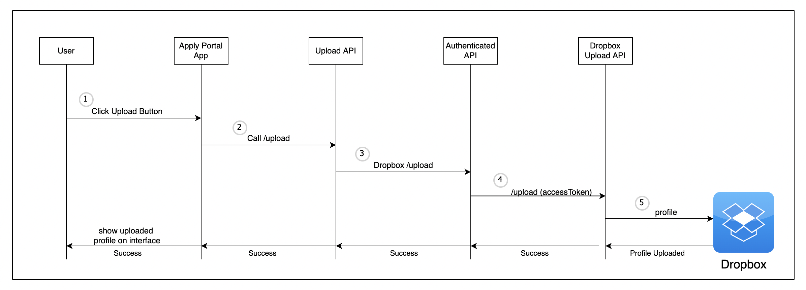
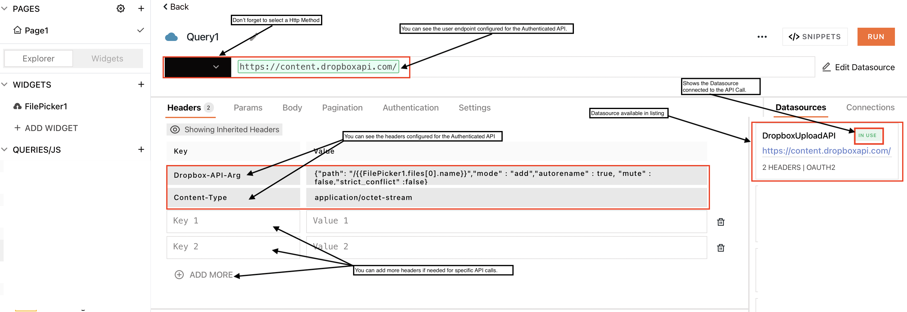
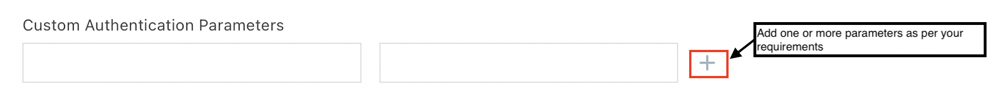
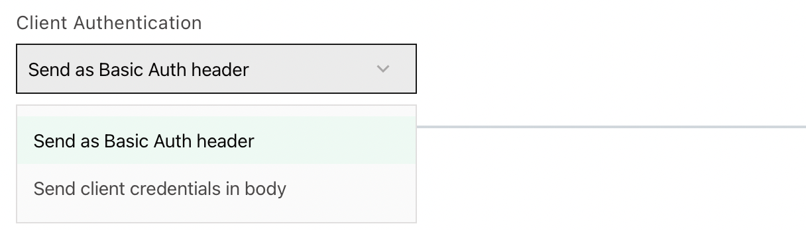
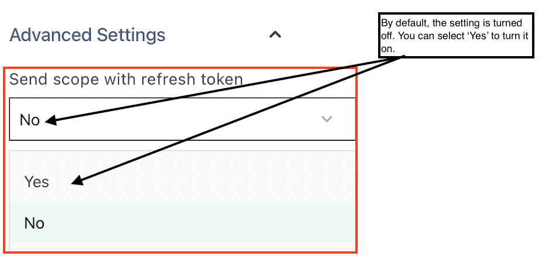
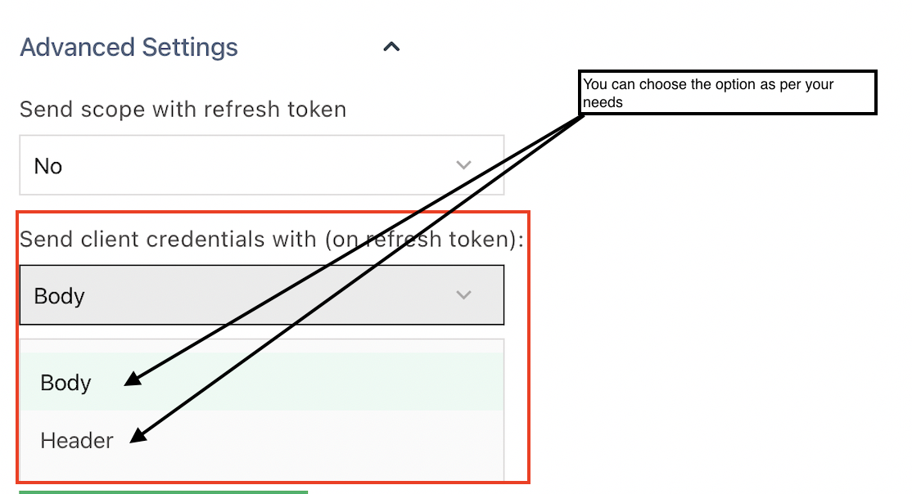

# 授权码

授权码是授权服务器授权的临时码.您可以获得访问令牌以换取授权码.获得访问令牌后,您可以使用它来访问资源或代表用户执行操作.

在 Appsmith 中, 您可以通过设置 `Authenticated API` 并将其配置为将 `Authorization Code` 用作授权类型来实现此目的.



### 与 Dropbox 集成 <a href="#e4-b8-8e-dropbox-e9-9b-86-e6-88-90" id="e4-b8-8e-dropbox-e9-9b-86-e6-88-90"></a>

让我们通过一个例子来了解授权码与 Dropbox 的集成.您有一个基于 Appsmith 构建的门户应用程序,您的应用程序用户使用它来上传他们的个人资料.您已经有一个与 Dropbox 集成的后端应用程序,并希望使用 Dropbox 来存储配置文件.为此,您必须创建一个经过身份验证的 API 并将其配置为与 Dropbox 连接.

#### 用户端点 <a href="#e7-94-a8-e6-88-b7-e7-ab-af-e7-82-b9" id="e7-94-a8-e6-88-b7-e7-ab-af-e7-82-b9"></a>

您必须连接到 Dropbox 平台上的用户端点才能执行 API 调用.导航到Dropbox 用于不同 API 调用 [exhaustive list of user endpoints](https://www.dropbox.com/developers/documentation/http/documentation).

> Dropbox 提供 [有关](https://www.dropbox.com/developers/documentation/http/documentation) 您必须添加到请求中的标题或内容类型的详细信息.

#### 配置经过身份验证的 API <a href="#e9-85-8d-e7-bd-ae-e7-bb-8f-e8-bf-87-e8-ba-ab-e4-bb-bd-e9-aa-8c-e8-af-81-e7-9a-84-api" id="e9-85-8d-e7-bd-ae-e7-bb-8f-e8-bf-87-e8-ba-ab-e4-bb-bd-e9-aa-8c-e8-af-81-e7-9a-84-api"></a>

上传文件配置 `Authenticated API` 如下表:

| **Appsmith**            | **Dropbox**                                                                                                                                                                                                                                            | **Value**                                                                                                                                                                             |
| ----------------------- | ------------------------------------------------------------------------------------------------------------------------------------------------------------------------------------------------------------------------------------------------------ | ------------------------------------------------------------------------------------------------------------------------------------------------------------------------------------- |
| **URL**                 | User Endpoint                                                                                                                                                                                                                                          | `https://content.dropboxapi.com/`                                                                                                                                                     |
| **Headers**             | `Dropbox-API-Arg`                                                                                                                                                                                                                                      | `{"path": "/{{`**`<`**` pick the file path from widget like`` ` \*\*`` **` `` FilePicker`**`>`**`\}}","mode" : "add","autorename" : true, "mute" : false,"strict\_conflict" :false}\` |
| **Headers**             | `Content-Type`                                                                                                                                                                                                                                         | `application/octet-stream`                                                                                                                                                            |
| **Authentication Type** | NA                                                                                                                                                                                                                                                     | OAuth 2.0                                                                                                                                                                             |
| **Grant Type**          | NA                                                                                                                                                                                                                                                     | Authorization Code                                                                                                                                                                    |
| **Access Token URL**    | Token Endpoint                                                                                                                                                                                                                                         | `https://api.dropboxapi.com/oauth2/token`                                                                                                                                             |
| **Client ID**           | Navigate to [Appconsole](https://www.dropbox.com/login?cont=https%3A%2F%2Fwww.dropbox.com%2Fdevelopers%2Fapps%3F\_tk%3Dpilot\_lp%26\_ad%3Dtopbar4%26\_camp%3Dmyapps) >> Select **App** >> **Settings** tab >> **App key**                              | Copy the App key and add in the Client ID field.                                                                                                                                      |
| **Client Secret**       | Navigate to [Appconsole](https://www.dropbox.com/login?cont=https%3A%2F%2Fwww.dropbox.com%2Fdevelopers%2Fapps%3F\_tk%3Dpilot\_lp%26\_ad%3Dtopbar4%26\_camp%3Dmyapps) >> Select **App** >> **Settings** tab >> **App secret**                           | Copy the App secret and add in the Client secret field.                                                                                                                               |
| **Scopes**              | Navigate to [Appconsole](https://www.dropbox.com/login?cont=https%3A%2F%2Fwww.dropbox.com%2Fdevelopers%2Fapps%3F\_tk%3Dpilot\_lp%26\_ad%3Dtopbar4%26\_camp%3Dmyapps) >> Select **App** >> **Permissions** tab >> select **Scope** `file.content.write` | Copy the scope `files.content.write` and add it to the field.                                                                                                                         |
| **Authorization URL**   | Authorization Endpoint                                                                                                                                                                                                                                 | `https://www.dropbox.com/oauth2/authorize`                                                                                                                                            |
| **Redirect URL**        | Navigate to [Appconsole](https://www.dropbox.com/login?cont=https%3A%2F%2Fwww.dropbox.com%2Fdevelopers%2Fapps%3F\_tk%3Dpilot\_lp%26\_ad%3Dtopbar4%26\_camp%3Dmyapps) >> Select **App** >> **Settings** tab >> **OAuth2** >> **Redirect URIs**          | Add the Redirect URL from Appsmith to the field and click add button.                                                                                                                 |

> 要创建应用程序,您还可以遵循 Dropbox 提供的[ OAuth guide ](https://developers.dropbox.com/zh-cn/oauth-guide).

保留其余设置并单击 `Save and Authorize` 按钮.您将被重定向到 Appsmith 上的数据源屏幕,响应状态为成功验证成功.

> 您可以通过查看浏览器地址栏中的来验证您的数据源验证是否成功 `response_status`

#### 上传文件 <a href="#e4-b8-8a-e4-bc-a0-e6-96-87-e4-bb-b6" id="e4-b8-8a-e4-bc-a0-e6-96-87-e4-bb-b6"></a>

用户将使用 `Filepicker` 小部件选择文件.每当用户选择文件并点击上传时,该按钮将触发上传文件的 API 调用.下面是 Portal App 和 Dropbox 交互的蓝图:



1. 用户选择一个文件并单击上传按钮.
2. 在 Appsmith 上的人将被调用 `Upload API`
3. 与 `Authenticated API` Dropbox API 对话以进行授权和生成令牌.生成的令牌将添加到上传 API 调用.
4. 上传请求在 Dropbox 上执行以上传文件.
5. Dropbox目录结构显示文件上传成功.

您可以将响应全部发送到 Portal App 以显示上传的文件或将其绑定以向亲密用户显示消息以成功上传.

让我们配置 Authentication API 以与 Dropbox 集成并创建上传文件的工作流程.



#### 创建查询 <a href="#e5-88-9b-e5-bb-ba-e6-9f-a5-e8-af-a2" id="e5-88-9b-e5-bb-ba-e6-9f-a5-e8-af-a2"></a>

导航到 **Explorer** → 单击查询/API 旁边的 **(+)** 在 **创建查询下选择.** `New <AuthenticatedAPIName> Query`

该操作为 Dropbox 添加了一个连接到数据源 (AuthenticatedAPI) 的 API.您将看到您为数据源配置的用户端点以及标头详细信息已经可用.



有两种方法可以将标头添加到 API:

**将标头添加到经过身份验证的 API**

您可以在配置时直接将标头添加到 Authenticated API.您可以在此处添加跨 API 通用的标头.例如,内容类型.

**向 API 添加标头**

当您将它们添加到平台时,您可以将标头添加到各个 API.您可以在此处添加特定于 API 的标头.

#### 添加小部件 <a href="#e6-b7-bb-e5-8a-a0-e5-b0-8f-e9-83-a8-e4-bb-b6" id="e6-b7-bb-e5-8a-a0-e5-b0-8f-e9-83-a8-e4-bb-b6"></a>

让我们在画布上添加一个文件选择器小部件并将其配置为触发 `Upload API` 调用.

* 导航到**小部件** → 在搜索栏中搜索 **FilePicker** 将小部件拖到画布上.
* 选择 `FilePicker` 小部件并导航到 `onFilesSelected` 属性窗格中可用的事件.
* 启用事件旁边可用的 JS
* 在输入框中添加以下代码.

```
{{UploadFileToDropbox.run() }} 
```

每当 FilePicker 小部件选择文件并且用户单击小部件上可用的上传按钮时,上述代码片段将触发 API 执行.

> 在任何给定的时间点,您都可以使用小胡子 `{{}}` 符号将数据添加到标题中.例如, `FilePicker1.files[0].name` 对于文件名.

一旦 API 调用成功,您可以导航到 Dropbox 界面并验证文件上传.

### 与 Google 文档集成 <a href="#e4-b8-8e-google-e6-96-87-e6-a1-a3-e9-9b-86-e6-88-90" id="e4-b8-8e-google-e6-96-87-e6-a1-a3-e9-9b-86-e6-88-90"></a>

让我们看看您可以使用 Authenticated API 进行的其他一些集成.在本节中,您将能够配置您的 Google Docs 集成到您的 Appsmith 应用程序.

#### 用户端点 <a href="#e794a8e688b7e7abafe782b9-1" id="e794a8e688b7e7abafe782b9-1"></a>

您必须连接到 Google Docs 平台上的用户端点才能执行 API 调用.Google Docs 提供了[与 Docs API 集成的详尽指南](https://developers.google.com/docs/api/how-tos/overview).

#### 配置身份验证 API <a href="#e9-85-8d-e7-bd-ae-e8-ba-ab-e4-bb-bd-e9-aa-8c-e8-af-81-api" id="e9-85-8d-e7-bd-ae-e8-ba-ab-e4-bb-bd-e9-aa-8c-e8-af-81-api"></a>

按照以下步骤为经过身份验证的 API 配置 Google 文档集成.



| **Appsmith**            | **Google Docs**                                                                                                                                                                                                                                                                                                                                                                                                                                                                                                                                                       | **Value**                                                                                                                                                                                                                          |
| ----------------------- | --------------------------------------------------------------------------------------------------------------------------------------------------------------------------------------------------------------------------------------------------------------------------------------------------------------------------------------------------------------------------------------------------------------------------------------------------------------------------------------------------------------------------------------------------------------------- | ---------------------------------------------------------------------------------------------------------------------------------------------------------------------------------------------------------------------------------- |
| **URL**                 | User Endpoint                                                                                                                                                                                                                                                                                                                                                                                                                                                                                                                                                         | `https://docs.googleapis.com/`                                                                                                                                                                                                     |
| **Authentication Type** | NA                                                                                                                                                                                                                                                                                                                                                                                                                                                                                                                                                                    | `OAuth 2.0`                                                                                                                                                                                                                        |
| **Grant Type**          | NA                                                                                                                                                                                                                                                                                                                                                                                                                                                                                                                                                                    | `Authorization Code`                                                                                                                                                                                                               |
| **Access Token URL**    | Token Endpoint                                                                                                                                                                                                                                                                                                                                                                                                                                                                                                                                                        | `https://oauth2.googleapis.com/toke`n                                                                                                                                                                                              |
| **Client ID**           | Navigate to [Google API Console](https://accounts.google.com/signin/v2/identifier?service=cloudconsole\&passive=1209600\&osid=1\&continue=https%3A%2F%2Fconsole.cloud.google.com%2Fapis%2Fdashboard\&followup=https%3A%2F%2Fconsole.cloud.google.com%2Fapis%2Fdashboard\&flowName=GlifWebSignIn\&flowEntry=ServiceLogin) >> Select Your Project that has Google Docs API Enabled >> Select Google API Docs on API/Service Details >> Click on Client Credentials >> Select the OAuth 2.0 Client >> Copy Client ID                                                     | Copy the Client ID and add in the Client ID field.                                                                                                                                                                                 |
| **Client Secret**       | <p>Navigate to <a href="https://accounts.google.com/signin/v2/identifier?service=cloudconsole&#x26;passive=1209600&#x26;osid=1&#x26;continue=https%3A%2F%2Fconsole.cloud.google.com%2Fapis%2Fdashboard&#x26;followup=https%3A%2F%2Fconsole.cloud.google.com%2Fapis%2Fdashboard&#x26;flowName=GlifWebSignIn&#x26;flowEntry=ServiceLogin">Google API Console</a> >> Select Your Project that has Google Docs API Enabled >> Select Google API Docs on API/Service Details >> Click on Client Credentials >> Select the OAuth 2.0 Client >></p><p>Copy Client Secret</p> | Copy the Client secret and add in the Client secret field.                                                                                                                                                                         |
| **Scopes**              | Navigate to [Google API doc ](https://developers.google.com/docs/api/reference/rest/v1/documents)>>Click the API you are integrating with for example (create) >> on the right Panel >> Try this method >> scroll to the **show scopes** link >> click on the link to reveal the scopes required for the API.                                                                                                                                                                                                                                                         | <p><a href="https://www.googleapis.com/auth/documents"><code>https://www.googleapis.com/auth/documents</code></a></p><p><a href="https://www.googleapis.com/auth/drive"><code>https://www.googleapis.com/auth/drive</code></a></p> |
| **Authorization URL**   | Authorization Endpoint                                                                                                                                                                                                                                                                                                                                                                                                                                                                                                                                                | `https://accounts.google.com/o/oauth2/auth`                                                                                                                                                                                        |
| **Redirect URL**        | Navigate to [Google API Console](https://accounts.google.com/signin/v2/identifier?service=cloudconsole\&passive=1209600\&osid=1\&continue=https%3A%2F%2Fconsole.cloud.google.com%2Fapis%2Fdashboard\&followup=https%3A%2F%2Fconsole.cloud.google.com%2Fapis%2Fdashboard\&flowName=GlifWebSignIn\&flowEntry=ServiceLogin) >> Select Your Project that has Google Docs API Enabled >> Select Google API Docs on API/Service Details >> Click on Client Credentials >> Select the OAuth 2.0 Client >>Authorized redirect URIs                                            | Add the Redirect URL from Appsmith to the field and click the save button.                                                                                                                                                         |

> 您可以按照 Google 提供的分步指南设置[ OAuth 2.0 客户端](https://support.google.com/cloud/answer/6158849?hl=en#zippy=%2Cuser-consent).

保持其他设置不变,然后单击 `Save & Authorize` 按钮创建 Authenticated API.系统会要求您登录您的 Google 帐户并授权数据源.成功通过身份验证后,您将导航到 Appsmith 数据源屏幕,地址栏中显示响应状态.成功的响应状态标志着数据源的成功配置

添加数据源后,您可以使用 google docs 界面创建查询并执行不同的操作.

> 您还可以查看操作指南- [如何添加 OAuth2 授权以将 Google 表格集成](https://docs.appsmith.com/learning-and-resources/how-to-guides/oauth2-authorization-for-google-sheets) 到 Appsmith.

### 与 Zoho Campaigns 集成 <a href="#e4-b8-8e-zoho-campaigns-e9-9b-86-e6-88-90" id="e4-b8-8e-zoho-campaigns-e9-9b-86-e6-88-90"></a>

让我们看看您可以使用 [Authenticated API](https://docs.appsmith.com/core-concepts/connecting-to-data-sources/authentication#create-authenticated-api) 进行的另一个集成.在本部分中,您将能够配置您的 Appsmith 应用程序以与 Zoho Campaigns 集成.

#### 用户端点 <a href="#e794a8e688b7e7abafe782b9-2" id="e794a8e688b7e7abafe782b9-2"></a>

您必须连接到 Zoho Campaigns 平台上的用户端点才能执行 API 调用.Zoho Campaigns 为 [与 Campaign API 集成提供了详尽的开发人员指南](https://www.zoho.com/campaigns/help/developers/campaign-management.html).

#### 配置经过身份验证的 API <a href="#e9858de7bdaee7bb8fe8bf87e8baabe4bbbde9aa8ce8af81e79a84-api-1" id="e9858de7bdaee7bb8fe8bf87e8baabe4bbbde9aa8ce8af81e79a84-api-1"></a>

按照以下步骤配置 Zoho Campaigns 的已验证 API 集成.



> Zoho API 是特定于位置的,即,如果您的组织位于美国 (US),那么您使用的 API 端点应该特定于`.com` 域.例如,如果你的组织位于美国,将使用 `https://campaigns.zoho.com/` 每当你在认证的API中配置URL时`Authenticated API`,要验证你的**组织**的**位置**.

| **Appsmith**            | **Zoho Campaigns**                                                                                                                                                                                                                    | **Value**                                                                        |
| ----------------------- | ------------------------------------------------------------------------------------------------------------------------------------------------------------------------------------------------------------------------------------- | -------------------------------------------------------------------------------- |
| **URL**                 | User Endpoint                                                                                                                                                                                                                         | `https://campaigns.zoho.in/api`                                                  |
| **Authentication Type** | NA                                                                                                                                                                                                                                    | `OAuth 2.0`                                                                      |
| **Grant Type**          | NA                                                                                                                                                                                                                                    | `Authorization Cod`e                                                             |
| **Access Token URL**    | Token Endpoint                                                                                                                                                                                                                        | `https://accounts.zoho.in/oauth/v2/token`                                        |
| **Client ID**           | Navigate to [Zoho API Console](https://accounts.zoho.com/signin?servicename=AaaServer\&context=\&serviceurl=https%3A%2F%2Fapi-console.zoho.com%2Flogin)>> Select Your Application >> Select Client Secret Tab>> Copy Client ID        | Add it to the Client ID field on Appsmith.                                       |
| **Client Secret**       | Navigate to [Zoho API Console](https://accounts.zoho.com/signin?servicename=AaaServer\&context=\&serviceurl=https%3A%2F%2Fapi-console.zoho.com%2Flogin)>> Select Your Application >> Select Client Secret Tab>> Copy Client Secret    | Add it to the Client secret field on Appsmith.                                   |
| **Scopes**              | Navigate to the [Zoho Campaign guide](https://www.zoho.com/campaigns/help/developers/campaign-details.html) and click on the API you want to integrate with and check the scope required.                                             | `Zohocampaigns.campaign.ALL`                                                     |
| **Authorization URL**   | Authorization Endpoint                                                                                                                                                                                                                | `https://accounts.zoho.in/oauth/v2/auth`                                         |
| **Redirect URL**        | Navigate to [Zoho API Console](https://accounts.zoho.com/signin?servicename=AaaServer\&context=\&serviceurl=https%3A%2F%2Fapi-console.zoho.com%2Flogin)>> Select Your Application >> Select Client Details>> Authorized Redirect URIs | Add the Redirect URL from Appsmith to the field and click the **Update** button. |

> 您可以按照 Zoho 提供的分步指南来 [注册客户端](https://www.zoho.com/people/api/oauth-steps.html).

对上述字段进行更改后,单击 `Save & Authorize` 按钮以创建 Authenticated API.您将被要求通过登录 Zoho 账户来授权数据源.您将被导航到 Appsmith 数据源屏幕,并在成功验证的地址栏中显示成功响应状态.

添加数据源后,您可以使用 Zoho Campaign 界面创建查询并执行不同的操作.

### 其他设置 <a href="#e5-85-b6-e4-bb-96-e8-ae-be-e7-bd-ae" id="e5-85-b6-e4-bb-96-e8-ae-be-e7-bd-ae"></a>

除了必需的设置外,还有一些可选设置已设置默认值,如果需要,您可以更改配置:

#### 自定义身份验证参数 <a href="#e8-87-aa-e5-ae-9a-e4-b9-89-e8-ba-ab-e4-bb-bd-e9-aa-8c-e8-af-81-e5-8f-82-e6-95-b0" id="e8-87-aa-e5-ae-9a-e4-b9-89-e8-ba-ab-e4-bb-bd-e9-aa-8c-e8-af-81-e5-8f-82-e6-95-b0"></a>

如果您的授权服务器需要您发送一些自定义查询参数作为访问令牌请求的一部分,您可以在此处添加这些参数.您可以根据需要添加一个或多个参数.例如,您的 API 需要一个 `showPrompt` 发送到授权服务器的参数,并且基于该参数,您的 API 逻辑要么向用户提示接受同意,要么不显示提示,因为已经记录了同意.在这种情况下,您可以将该 `showPrompt` 参数配置为自定义参数.



#### 客户端认证 <a href="#e5-ae-a2-e6-88-b7-e7-ab-af-e8-ae-a4-e8-af-81" id="e5-ae-a2-e6-88-b7-e7-ab-af-e8-ae-a4-e8-af-81"></a>

如果您的 API 需要发送客户端凭据,那么您可以使用客户端身份验证字段.您可以选择将客户端凭据作为以下内容的一部分发送:



* 通过选择**作为 Basic Auth Header 发送的基本授权标头.**
* 通过选择**在正文中发送客户端凭据,以客户端凭据的形式发送正文.**

### 高级设置 <a href="#e9-ab-98-e7-ba-a7-e8-ae-be-e7-bd-ae" id="e9-ab-98-e7-ba-a7-e8-ae-be-e7-bd-ae"></a>

您可以将一些高级设置配置为 Authenticated API 的一部分.

#### 使用刷新令牌发送范围 <a href="#e4-bd-bf-e7-94-a8-e5-88-b7-e6-96-b0-e4-bb-a4-e7-89-8c-e5-8f-91-e9-80-81-e8-8c-83-e5-9b-b4" id="e4-bd-bf-e7-94-a8-e5-88-b7-e6-96-b0-e4-bb-a4-e7-89-8c-e5-8f-91-e9-80-81-e8-8c-83-e5-9b-b4"></a>

使用此配置,您可以选择发送为 API 配置的范围以及刷新令牌.默认情况下,该设置处于关闭状态.您可以通过选择 **Yes** 打开设置.



#### 使用（在刷新令牌上）发送客户端凭据 <a href="#e4-bd-bf-e7-94-a8-e5-9c-a8-e5-88-b7-e6-96-b0-e4-bb-a4-e7-89-8c-e4-b8-8a-e5-8f-91-e9-80-81-e5-ae-a2-e" id="e4-bd-bf-e7-94-a8-e5-9c-a8-e5-88-b7-e6-96-b0-e4-bb-a4-e7-89-8c-e4-b8-8a-e5-8f-91-e9-80-81-e5-ae-a2-e"></a>

您可以通过配置此字段来选择发送客户端凭据以及刷新令牌.您可以通过选择 **header** 来选择将客户端凭据作为 header 的一部分发送,或者通过选择**body** 来选择作为 body 的一部分发送



通过 OAuth 2.0 集成,您可以将 API 连接到 Appsmith 并构建复杂的应用程序.
