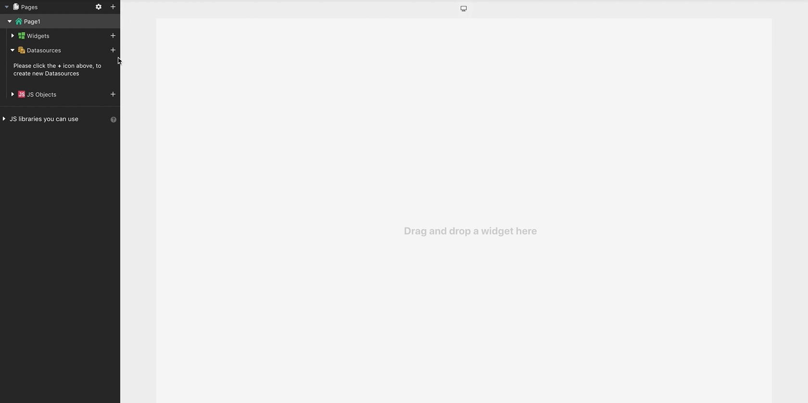

# 连接到数据库

### 支持的数据库 

* [Amazon S3 (also Upcloud, Digital Ocean Spaces, Wasabi, DreamObjects)](https://docs.appsmith.com/reference/datasources/querying-amazon-s3)
* [ArangoDB](https://docs.appsmith.com/reference/datasources/querying-arango-db)
* [DynamoDB](https://docs.appsmith.com/reference/datasources/querying-dynamodb)
* [ElasticSearch](https://docs.appsmith.com/reference/datasources/querying-elasticsearch)
* [Firestore](https://docs.appsmith.com/reference/datasources/querying-firestore)
* [MongoDB](https://docs.appsmith.com/reference/datasources/querying-mongodb)
* [MS SQL](https://docs.appsmith.com/reference/datasources/querying-mssql)
* [MySQL](https://docs.appsmith.com/reference/datasources/querying-mysql)
* [PostgreSQL](https://docs.appsmith.com/reference/datasources/querying-postgres)
* [Redis](https://docs.appsmith.com/reference/datasources/querying-redis)
* [Redshift](https://docs.appsmith.com/reference/datasources/querying-redshift)
* [Snowflake](https://docs.appsmith.com/reference/datasources/querying-snowflake-db)

### 安全 

Appsmith 安全地加密您的所有数据库凭据并安全地存储它们.Appsmith 也不存储从您的数据源返回的任何数据,仅充当代理层来编排 API/查询调用.由于 Appsmith 是一个开源框架,您可以 [deploy it on-premise](https://docs.appsmith.com/getting-started/setup), 并对其进行审核以确保您的所有数据都不会离开您的 VPC.

### 连接到数据库 

> 在连接到数据源之前,您可能需要将 Appsmith 部署在您的数据库实例或 VPC 上的 IP 地址列入白名单.
>
> **18.223.74.85** 和 **3.131.104.27** 是需要列入白名单的 Appsmith 云实例的 IP 地址.

一旦 appsmith 实例被列入 [白名单](https://docs.appsmith.com/learning-and-resources/how-to-guides/aws-whitelist):

1. 单击 **数据源** 旁边的 **+**
2. 您将看到 Appsmith 可以连接到的数据源列表
3. 从 [支持列表](https://docs.appsmith.com/core-concepts/connecting-to-data-sources/connecting-to-databases#supported-databases) 中选择一个数据库
4. 提供连接到您的数据库所需的配置细节.您可能需要联系您的数据库管理员,将 [appsmith cloud](https://docs.appsmith.com/learning-and-resources/how-to-guides/aws-whitelist) 设置到白名单
5. 单击 **测试** 以验证 Appsmith 是否能够使用您提供的详细信息连接到您的数据库
6. **保持** 您的 **数据库**

> 组织内任何地方的开发人员都可以访问在应用程序的一页内配置的数据库

### 一般注意事项 

当您首次将数据库服务器连接到您的应用程序时,Appsmith 会创建一个与数据库服务器的新连接池.Appsmith 对您的数据库执行的所有后续查询然后重新使用此连接以确保在运行时快速执行您的查询.如果数据库服务器关闭了空闲连接,Appsmith 会在执行下一个查询时创建一个新连接.

对于 PostgreSQL 和 MySQL 等某些插件,Appsmith 创建并维护一个连接池,因为无法针对单个连接执行多个查询.

#### 并发查询 

Appsmith 将可以在数据库上同时运行的最大查询数限制为 5.如果应用程序尝试同时进行更多查询,您将看到一条错误消息 `Connection not available`.
