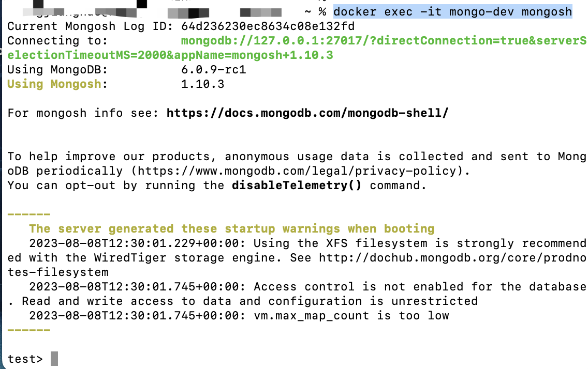

# mongo副本集配置

PagePlug1.9的版本如果使用外部 mongo，需要 mongo5.0 或者更高的版本，并且需要设置 replica set


如果使用的外部mongo在部署启动时没有设置副本集的话，启动成功后在容器内设置是行不通的。


**副本集需要在启动mongo镜像的时候就配置好**



这边分享下mongo副本集配置的教程（本次案例使用的是mongo6.0-rc版本）


## 1、可以先在官方dockerhub上选择需要安装的版本

本次案例选择的是6.0-rc版本，可以直接复制镜像的命令，在终端中输入拉取镜像

```
docker pull mongo:6.0-rc
```

<figure><figcaption></figcaption></figure>

稍等一会后，镜像就拉取成功了（或者通过命令docker ps 查看下）

<figure><figcaption></figcaption></figure>

## 2、在启动mongo的时候，需要带上副本集的命令

输入下面命令启动mongo（本次案例没有设置用户名称密码和数据库名称，需要设置的可自行带上对应的环境变量）

```
docker run --name mongo-dev -p 27022:27017 -d mongo:6.0-rc --replSet my-replica-set
```

**有两个地方需要注意下：**


1、如果端口27017被占用的话，可以修改下前面的端口再启动，例如上面所示：<mark style="color:red;">27022</mark>:27017

2、【-d】 后面需要输入对应的镜像及版本，例如本次启动的的镜像是<mark style="color:red;">mongo:6.0-rc</mark>


出现了一串字符内容后就是启动成功了

<figure><figcaption></figcaption></figure>

也可以检查下容器镜像是否启动成功

<figure><figcaption></figcaption></figure>

## 3、进入MongoDB Shell 中执行初始化

我们可以在终端输入以下命令（该命令对mongo6版本有效）

```
docker exec -it mongo-dev mongosh
```

**有两个地方注意一下：**


1、上面的命令如果是mongo5以上的版本，请输入`docker exec -it` `mongo-dev` `mongo`

`2、其他版本的命令没有尝试，可自行查看官网处理`


会显示下列内容，进入到mongo shell了

<figure><figcaption></figcaption></figure>

之后我们进行初始化，输入下列命令

```
rs.initiate({})
```

看到下列内容副本集已配置成功

<figure><figcaption></figcaption></figure>
