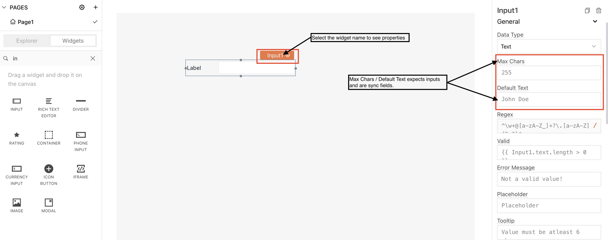
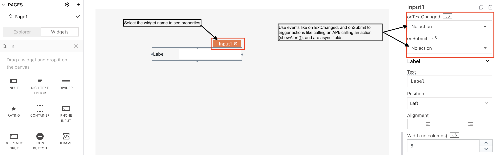
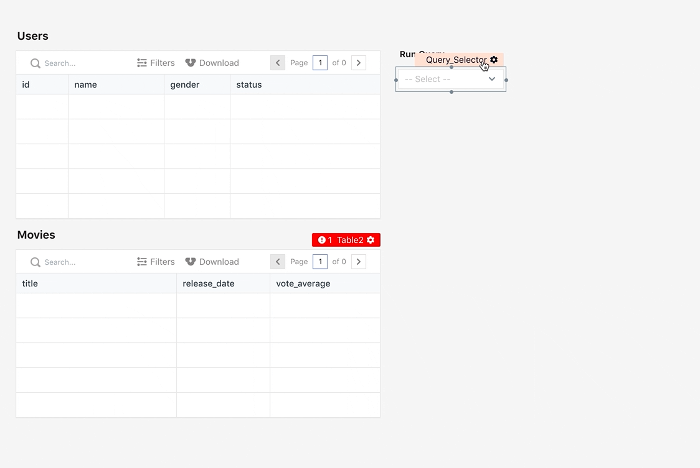

# 创建工作流

本文档假定您熟悉从小部件 [触发操作](https://docs.appsmith.com/core-concepts/writing-code/readme-1#functions) 并扩展触发更复杂的操作以创建工作流。

## 字段

小部件具有可用于绑定数据或触发操作的字段。Appsmith 已将字段分为同步和异步字段。

### 同步字段

每当您在画布上拖动小部件时，您都可以选择它并在属性窗格中查看与其关联的属性。属性窗格中需要输入或数据的字段称为同步字段。



例如，如果您向画布添加了一个 Input 小部件，则 MaxChars、Regex、错误消息等属性需要一些输入并且是同步字段。

### 异步字段

可以触发操作或执行操作的属性称为异步字段。



例如，输入小部件的 和 等属性被视为异步字段 `OnTextChanged`。`OnSubmit`您可以使用这些属性来定义操作或执行[操作](https://docs.appsmith.com/core-concepts/writing-code/readme-1#functions).

### 在同步字段中使用异步函数响应

让我们看一些示例来了解如何在同步字段中使用异步函数。

#### 用例

您正在获取所有用户并在页面上显示名字、姓氏、电子邮件等信息。您有一个表格小部件来显示数据。

#### 使用 API

您有一个获取用户的 API。您想触发 API 执行，因此将 API 调用绑定到小部件，生成的响应将显示在表格中。

添加表格小部件；导航到`Explorer`>>单击`Widgets`>>搜索`table`>>将表格小部件拖到画布上。



使用 API 读取数据： 创建 API -`getAllUsers`在 Appsmith 上添加`API` from `Explorer`>> Click `(+)`Query/JS >> Select `New Blank AP`I>> Rename to `getAllUsers`（或选择现有 API） 将 API 调用添加到表小部件的表数据属性如下面的代码片段所示：

```
// {{getAllUsers.data}}
```

> 表的 表数据属性 需要 **JSON 数组**，因此请验证您的 API 返回 **JSON 数组**。&#x20;

一个`{{API.run()}}`方法，如果提供给[Table data](https://docs.appsmith.com/reference/widgets/table#table-data),，将会抛出一个错误，因为 table data 是一个 Sync 字段并且不能执行执行。但是，您可以通过访问 API 的 data 属性来读取 API 生成的响应`{{API.data}}`。当您将 API 数据属性绑定到小部件时，Appsmith**在页面加载时**执行 API 。如果您不想**在页面加载时**执行 API，您可以修改 API 设置。

#### 使用 JSObject

您有一个 JSObject 函数，它获取所有用户的信息，过滤`firstname`&`email`,的数据，然后返回结果，以便您可以将其绑定到表小部件并显示信息。


如何从同步字段调用异步 JSObject 函数？


通过调用 JSObject 函数来读取数据： 创建一个 JSObject -`getFilteredUsersList`在 Appsmith 上通过添加`JSObject`from `Explorer`>> Click `(+)` Query/JS >> Select `New JS Object`>> Rename to `getFilteredUsersList`（或选择现有的 JSObject） 您可以将 API 或查询调用添加到函数调用并过滤数据以获得所需的详细信息，如下所示：

```
// export default {
	userFilteredList: async () => {
	const listUser = await getAllUsers.run();
		return listUser.map((user) => {
			return {
				"firstname" : user.name,
				"email" : user.email
			}
		})		
	}
}
```

对JSObject `getFilteredUsersList.userFilteredList()`的函数调用将抛出一个错误，因为表数据是同步域，不能执行函数。然而，你可以通过添加`({{getFilteredUsersList.userList.data}})`使用JSObject的函数响应，通过读取函数的响应。Appsmith**在页面加载时**处理JSObject函数的执行。如果你希望不**在页面加载时**执行函数，你可以从设置标签中修改异步函数设置。

#### 使用查询

您有一个获取用户信息、返回响应并将其绑定到表小部件以显示数据的查询。


如何从同步字段触发查询执行？


通过调用查询来读取数据：创建一个查询 -`fetchUsersList`在 Appsmith 上通过添加`Query`from `Explorer`>> 单击(+) Query/JS >> 选择`DatabaseName`要为其添加查询 >> 重命名`fetchUsersList`（或选择现有查询）假设表名是用户。将以下代码添加到查询编辑器。

提示 - 用数据库中的表名替换用户

```
// SELECT * FROM users ORDER BY id LIMIT 10;
```

对查询的执行调用`fetchUsersList.run()`将引发错误，因为表数据需要数据并且无法执行查询执行。但是，您可以读取查询响应并在表数据中使用它来显示记录`(fetchUsersList.data)`。Appsmith在**页面加载时**处理查询执行。如果您不想在**页面加载时**执行查询，您可以从设置选项卡修改查询设置

## 活动

您可以通过将它们与异步字段绑定来触发操作。例如，您想通过使用 显示提交按钮的成功消息`showAlert()`。您必须在事件上绑定 \[ `showAlert()`]（添加到 Actions - Show Alert 方法的链接）功能`onClick()`。

> 您只能在**异步字段**（即事件或操作）中使用 Appsmith 开箱即用的**全局操作**。



### 处理成功/错误

属性窗格允许我们配置在 Query 返回成功或错误时采取的操作。成功/错误由 HTTP 状态码或 API/Query 返回的查询响应状态决定。

我们可以通过使用 **showAlert Action** 来决定显示成功或错误的消息。


## 复杂的工作流程

GUI 仅限于单个 onSuccess / onError 回调，而底层框架则没有限制。要编写 GUI 中无法容纳的复杂工作流程，请单击事件名称旁边的**JS图标并启用 JavaScript**。现在您可以编写条件工作流并链接多个查询。



> 使用 GUI 配置操作后，您可以单击事件旁边的 JS 图标以显示与您的配置等效的 JavaScript。这可以帮助您学习使用 JavaScript 来配置工作流！

### 并行/串行执行查询

每个查询对象都包含一个用于执行它的 run 方法。run 方法是异步的，可以并行执行多个查询，如下所示

```
// {{ API1.run(); Query2.run(); API2.run(); }}
```

或使用运行中的回调参数链接到调用 onSuccess / onError

```
// {{ 
    updateUsers.run()
	    .then(() => fetchUsers.run()
	                .then(() => { 
	                    showAlert('User Updated'); 
	                    closeModal('Modal1'); 
		                })
				.catch(() => showAlert("Fetch Users Failed"))
	    ).catch(() => showAlert("Update User Failed", "error")) 
}}
```

### 条件执行

查询也可以链接起来，根据小部件的值或查询的响应有条件地执行。

```
// {{ 
  statusDropdown.selectedOptionValue === "Pending" ?
      fetchPendingUsers.run(() => {
          fetchPendingUsers.data.length === 0 ? showAlert("No Users Pending Approval", "info") : showAlert("Fetched Users", "success");
      }) :
      fetchApprovedUsers.run();
}}
```

要为您的应用程序快速构建逻辑，请使用 [Appsmith 框架](https://docs.appsmith.com/core-concepts/writing-code/readme-1) 和 [外部库](https://docs.appsmith.com/core-concepts/writing-code/ext-libraries) 。
