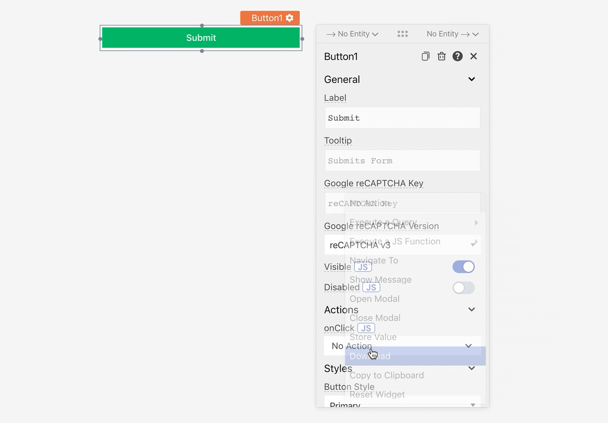

# 捕获数据（写入）

本文档假定您已成功 [连接到数据源](https://docs.appsmith.com/core-concepts/connecting-to-data-sources) 并具有可以插入/更新/删除数据的查询.您还应该了解 [使用小部件](https://github.com/appsmithorg/appsmith-docs/blob/v1.4/core-concepts/data-access-and-binding/capturing-data-write/broken-reference/README.md)的基础知识.

以下小部件可用于捕获应用程序中的用户输入

* [Checkbox](https://docs.appsmith.com/reference/widgets/checkbox)
* [Datepicker](https://docs.appsmith.com/reference/widgets/datepicker)
* [Filepicker](https://docs.appsmith.com/reference/widgets/filepicker)
* [Form](https://docs.appsmith.com/reference/widgets/form)
* [Input](https://docs.appsmith.com/reference/widgets/input)
* [Maps](https://docs.appsmith.com/reference/widgets/maps)
* [Radio Group](https://docs.appsmith.com/reference/widgets/radio-group)
* [Rich Text Editor](https://docs.appsmith.com/reference/widgets/rich-text-editor)
* [Select](https://docs.appsmith.com/reference/widgets/dropdown-1)
* [Switch](https://docs.appsmith.com/reference/widgets/switch)

小部件将其用户输入存储在可以使用 javascript 引用的内部属性中.

### 示例 SQL <a href="#e7-a4-ba-e4-be-8b-sql" id="e7-a4-ba-e4-be-8b-sql"></a>

```sql
INSERT INTO users ("name", "createdAt", "gender")
  VALUES ({{nameInput.text}}, {{moment().format("YYYY-MM-DD")}}, 
  {{genderDropdown.selectedOptionValue}});
```

#### **示例帖子正文**

```sql
{
  "name": {{nameInput.text}},
  "createdDate": {{moment().format('YYYY-MM-DD')}},
  "gender": {{genderDropdown.selectedOptionValue}}
}
```

在上面的例子中, **`text`** 是 **`nameInput`** 小组件的内部属性,而 **`selectedOptionValue`** 是 **`genderDropdown`** 小组件的内部属性. **`createdDate`** 是使用 `moment.js` 库用当前日期的值来填充的.

## 触发更新 <a href="#e8-a7-a6-e5-8f-91-e6-9b-b4-e6-96-b0" id="e8-a7-a6-e5-8f-91-e6-9b-b4-e6-96-b0"></a>

由于写入操作成本更高,因此应在捕获所有用户数据后触发查询.为此,我们可以使用 [Button](https://file+.vscode-resource.vscode-cdn.net/Users/fengqiong/Desktop/widget-reference/button/) 小部件并将 Query 配置为在按钮的 onClick 中运行.

属性窗格有一个操作部分,其中列出了用户可以使用小部件执行的所有交互.我们可以在本节中配置交互发生时要执行的操作.

要配置单击按钮时要调用的查询,我们可以在 onClick 下拉列表中选择操作.


