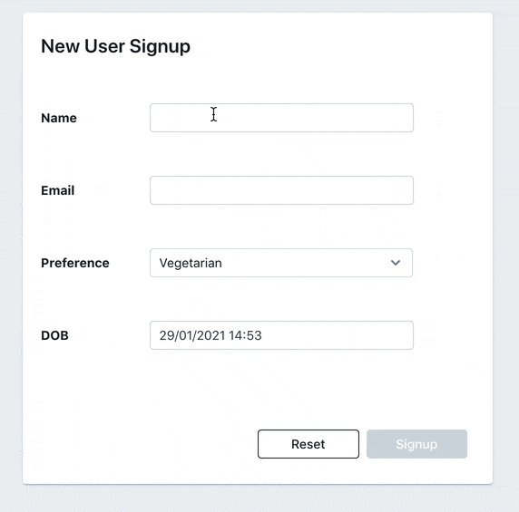

# 捕获表单数据

[Form 小部件](https://docs.appsmith.com/reference/widgets/form) 是一种特殊类型的容器,用于构建经过验证的表单.可以在表单小部件内拖动多个小部件以捕获数据.表单小部件带有一个预先配置的表单按钮.

如果表单按钮被禁用

* 表格内的任何 **必填字段** 均未填写
* 表单包含一个输入,其值与配置的正则表达式不匹配

### 提交表单数据 

可以使用 PUT / POST API 或插入 / 更新查询来提交表单数据.要提交表单数据,

1. 绑定表单按钮的onClick调用API/Query
2. 配置 onSuccess 以显示成功消息
3. 配置 API / Query 以使用 Javascript 从表单小部件中读取输入

> 当表单按钮 onClick 成功时,表单内的小部件会自动重置为其默认值.这可以在按钮属性中禁用

## 显示提交的数据 

一旦 API / Query 更新数据,屏幕上的小部件也需要使用新数据进行更新.实现这一点的最佳方法是简单地从 API / Query 重新获取数据,而不是尝试将数据附加到现有数据集.这可以在 API/Query 的 onSuccess 中完成.

> 属性窗格 UI 支持单个 onSuccess 回调,但可以通过单击属性旁边的 JS 按钮来配置多个回调和条件.了解有关 [创建](https://docs.appsmith.com/core-concepts/writing-code/workflows)

## 发布 URL 编码的表单数据 

编码类型可以通过以下方式选择 **Body** API编辑器上的下拉菜单,选择 `application/x-www-form-urlencoded` 这个值将对body字段中发送的值进行自动编码.
