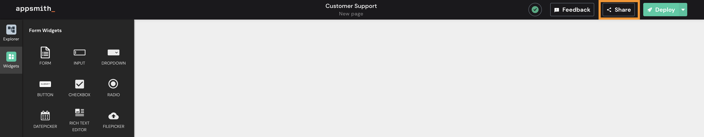
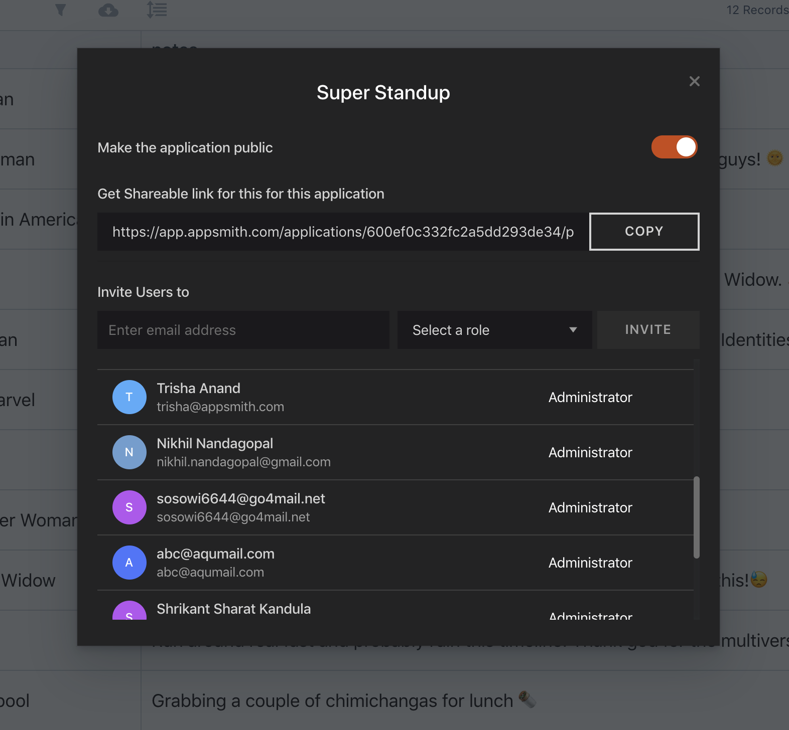

# 访问控制

通过单击应用程序主页上的 **share button** 或从应用程序内部邀请用户加入您的组织

邀请您希望与之共享应用程序的用户的电子邮件,并为他们选择适当的角色.

## 角色 

Appsmith通过将一组权限分配给不同的用户角色来实现 **RBAC** 这些权限决定了用户可以在平台上执行的操作.下面是每个角色的权限映射.

* **行政人员:**
  * 创建/编辑应用
  * 查看应用
  * 公开应用
  * 邀请用户
  * 管理用户
* **开发人员**
  * 创建/编辑应用
  * 查看应用
  * 邀请用户
* **应用查看器**
  * 查看应用
  * 仅邀请用户作为应用查看者

## 权限 

* **创建/编辑应用程序:** 此权限允许用户在组织内创建和编辑应用程序.
* **查看应用程序:** 此权限允许用户查看和使用组织内部的应用程序
* **使应用程序公开:** 此权限允许用户将应用程序标记为可在组织外部访问.
* **邀请用户:** 此权限允许用户邀请角色等于或低于他们的其他人.
* **管理用户:** 此权限允许用户从组织中删除用户.

## 公共应用 

应用程序可以公开并与不属于您组织的外部用户共享.这些应用程序不需要用户进行身份验证即可使用它们.通过单击应用程序内的共享按钮并打开公共应用程序开关,可以将应用程序公开.要共享应用程序,请复制模式中显示的链接并与您的用户共享！

> 只有管​​理员可以公开应用程序.
