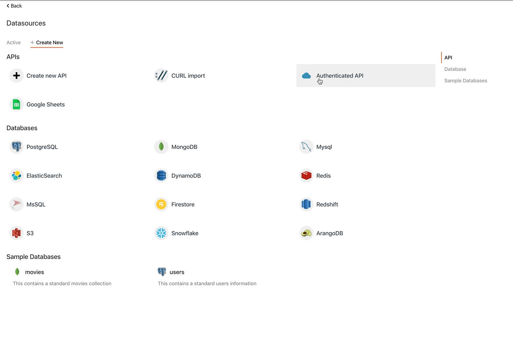

# 基本的

要跨多个 API 共享基本身份验证详细信息,您可以使用 `Basic` 数据源中的身份验证机制.为此,请单击 `+` 数据源部分旁边的图标并添加经过身份验证的 API.输入 API 的基本 URL (例如 [**https://airtable.com**](https://airtable.com/)) 并选择身份验证类型为 **Basic**.

现在可以在身份验证部分下配置用户名和密码,并将 base64 版本的 username:password 添加到此数据源下添加的所有 API 的标头中.保存此数据源并添加新 API

