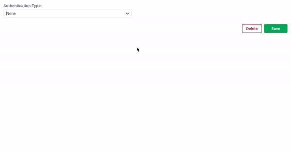

# 客户凭证

客户端凭据授予通常用于服务器到服务器的通信.这意味着这种类型的数据源一旦配置就不需要用户干预.Appsmith 安全地加密您的凭据,并将这些凭据重用于使用此数据源发出的所有 API 请求.

与此授权类型相关的字段如下:

* `Add Access Token To`**:** 此字段配置API请求中将发送访问令牌信息的字段.（查询参数或标题）.
* `Header Prefix`**:** 如果将访问令牌作为授权标头发送,您可以使用此字段配置要使用的前缀.
* `Access Token URL`**:** 这是身份验证服务器上的端点,Appsmith 应该访问该端点以交换访问令牌的授权代码.
* `Client ID`**:** 应用注册过程中发给客户端的客户端标识符
* `Client Secret`**:** 在应用注册过程中发给客户端的客户端密钥.该字段被加密并存储在 Appsmith 数据库中.为避免网络上的任何安全威胁,Appsmith 不允许用户在保存数据源后查看客户端密码.
* `Scope(s)`**:** 访问请求的范围.它可能有多个逗号分隔的值.

> 如果您觉得您的基础设施中可能存在数据泄露,您可以简单地在授权服务器上使您的客户端凭据无效,以立即撤销 Appsmith 对您的资源的访问.
