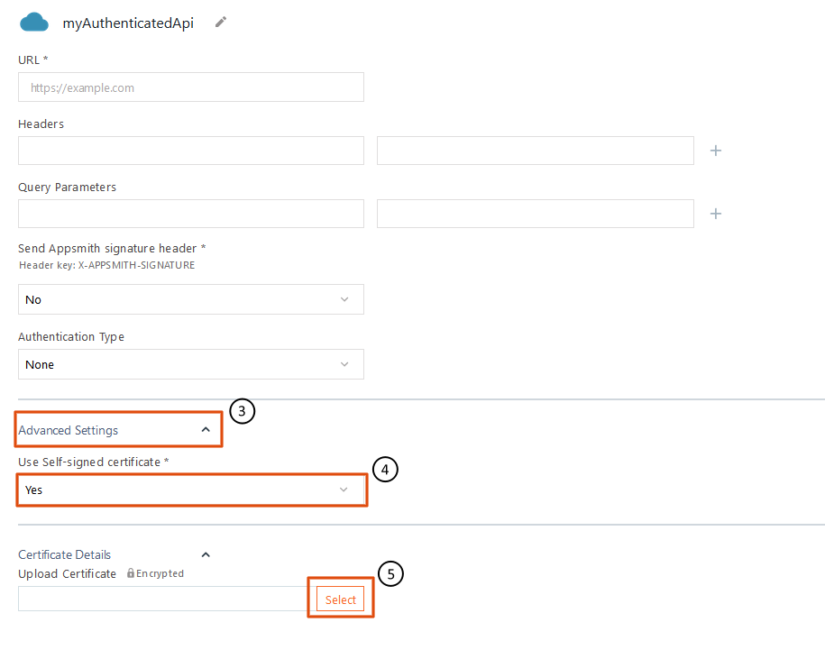
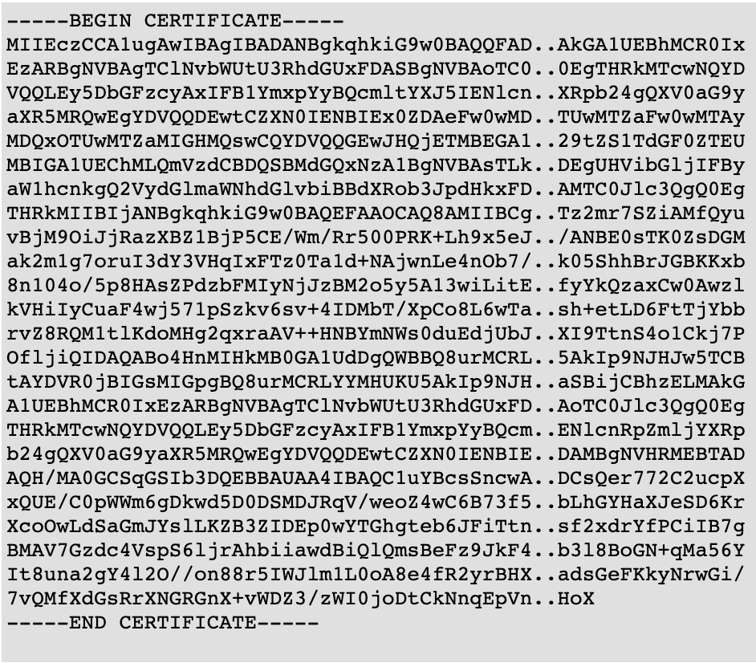

# 自签名证书

自签名证书有时用于测试或内部环境,因为它们提供传入/传出数据加密,并且可以免费快速创建.但是,这种做法可能会带来显着增加的安全风险,因此应仔细考虑.

如果您需要使用自签名证书来访问您的 REST 端点, [**Authenticated API**](https://docs.appsmith.com/core-concepts/connecting-to-data-sources/authentication) \*\*\*\* 允许您在 API 的配置页面中上传您自己的自签名证书.

要上传您的自签名证书:

1. 在 Explorer 窗格中导航到您的 Authenticated API 数据源.如果您还没有创建一个,您可以在 [Authenticated API 文档](https://docs.appsmith.com/core-concepts/connecting-to-data-sources/authentication#create-authenticated-api) 中找到说明.
2. 单击窗口右上角的 **Edit** .
3. 单击以打开窗口底部的 **Advanced Settings** 下拉菜单.
4. 将 **Use Self-signed certificate\*** 设置为 "Yes".
5. 在新的 **Upload Certificate** 字段中,单击 **Select** 按钮.现在您可以浏览以查找并上传您的自签名证书文件.

此信息需要以 .PEM（隐私增强邮件）格式提供,如下所示.证书信息以加密格式安全地存储在数据库中.

