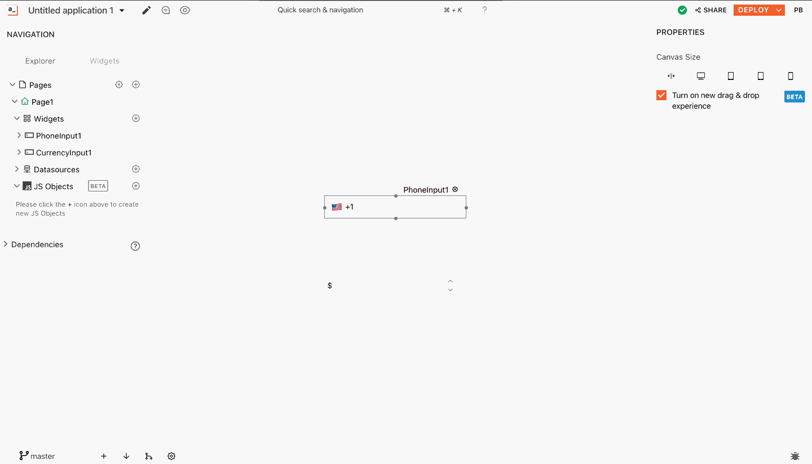

# 使用分支

连接到存储库时的初始提交是在主分支上进行的。如果你想独立处理一个特性，你可以创建一个单独的分支。

要创建一个新分支 -

* 点击左下角的分支按钮。您可以从分支弹出窗口切换到现有分支或创建新分支。
* 当您切换到另一个分支时，当前分支中未提交的更改不会转移到目标分支。

但是，如果您创建一个新分支，它将包含您父分支的未提交更改。

> * 分支名称不应以该前缀开头，`origin/`因为此前缀用于区分分支的本地版本和远程版本。
> * 用已经可用的本地对应物签出远程分支将导致错误。
> * 如果您创建一个新分支，它将包含您父分支的未提交更改。当您切换到另一个分支时，当前分支中未提交的更改不会被转移到目标分支。在这两种情况下，当前分支都将保留未提交的更改。

#### 本地与远程分支同步

要将本地与远程分支同步（获取或修剪），请单击分支弹出窗口并点击“同步分支“ 按钮。

同步分支不会合并您在远程分支上所做的任何更改。您必须单击拉动按钮以获取最新更改。
