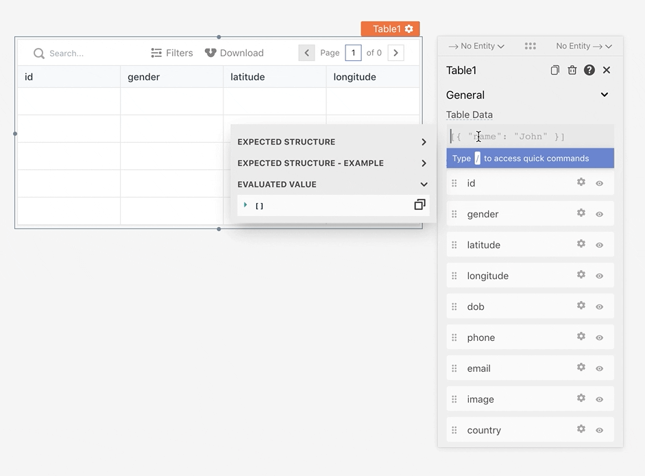
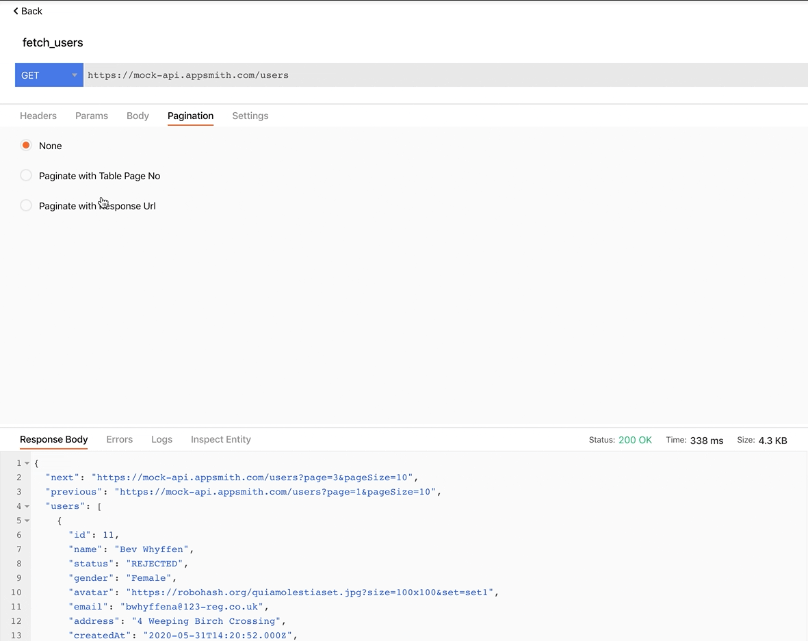
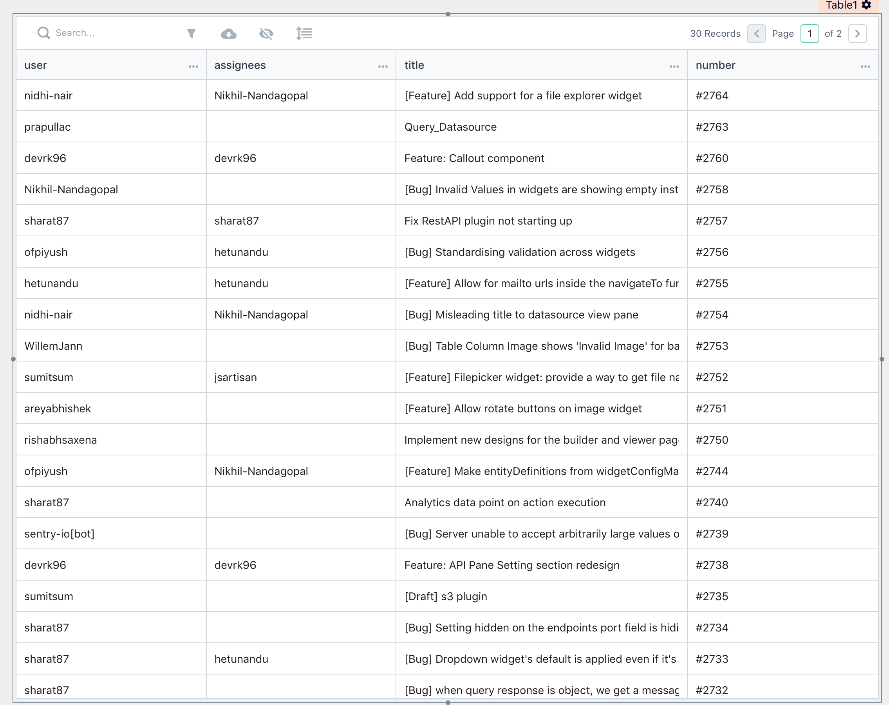

# 在表格中显示数据

[Table Widget](https://docs.appsmith.com/reference/widgets/table) 帮助我们可视化从数据源返回的信息行.我们使用 Table Data 属性来显示表格中的数据.



## 分页 <a href="#e5-88-86-e9-a1-b5" id="e5-88-86-e9-a1-b5"></a>

通常需要表格来显示来自查询和 API 的大型数据集,但浏览器无法加载我们数据库中存在的所有数据.要对这些数据进行分页,我们可以：

1. 在表格中启用服务器端分页属性
2. 调用 API / 查询 onPageChange
3. 在 API / Query 中配置分页

### 基于偏移的分页 <a href="#e5-9f-ba-e4-ba-8e-e5-81-8f-e7-a7-bb-e7-9a-84-e5-88-86-e9-a1-b5" id="e5-9f-ba-e4-ba-8e-e5-81-8f-e7-a7-bb-e7-9a-84-e5-88-86-e9-a1-b5"></a>

此方法使用表的页码来确定要从数据库中获取的记录的偏移量.此方法依赖于 Table 的 pageNo 和 pageSize 字段,用于 API 和 Queries.

pageNo 和 pageSize 可以在 API / Query 中通过引用它们来使用 `{{ }}`

```sql
select * from users limit {{ Table1.pageSize }} offset {{ (Table1.pageNo - 1) * Table1.pageSize }}
```

```
https://mock-api.appsmith.com/users?page={{Table1.pageNo}}
```

### 基于键的分页 <a href="#e5-9f-ba-e4-ba-8e-e9-94-ae-e7-9a-84-e5-88-86-e9-a1-b5" id="e5-9f-ba-e4-ba-8e-e9-94-ae-e7-9a-84-e5-88-86-e9-a1-b5"></a>

此方法使用 API 响应中的值作为下一次 API 调用的键.这可以通过提供 API 应在 onPageChange 上执行的下一个和上一个 URL 在 API 设置中进行配置.



## 服务器端搜索/过滤 <a href="#e6-9c-8d-e5-8a-a1-e5-99-a8-e7-ab-af-e6-90-9c-e7-b4-a2-e8-bf-87-e6-bb-a4" id="e6-9c-8d-e5-8a-a1-e5-99-a8-e7-ab-af-e6-90-9c-e7-b4-a2-e8-bf-87-e6-bb-a4"></a>

表格带有客户端搜索和开箱即用的过滤功能.要在服务器端执行这些操作,我们必须将这些值传递给 API / Query.

**搜索**

1. 从表中调用 API/查询 onSearchTextChange
2. 将 Table 的 searchText 的值传递给 API/Query

```sql
select * from users where name ilike {{"%" + Table1.searchText + "%"}}
```

```
https://mock-api.appsmith.com/users?name={{Table1.searchText}}
```

**过滤**

服务器端过滤要求我们使用另一个小部件,例如下拉菜单,它可以为用户提供我们的 API 支持的过滤器列表.

1. 拖动下拉列表并使用过滤器值填充它
2. 从表中调用 API/查询 onOptionChange
3. 将 Dropdown 的 selectedOptionValue 的值传递给 API / Query

```sql
select * from users where gender = {{genderDropdown.selectedOptionValue}}
```

```
https://mock-api.appsmith.com/users?gender={{genderDropdown.selectedOptionValue}}
```

## 转换表数据 <a href="#e8-bd-ac-e6-8d-a2-e8-a1-a8-e6-95-b0-e6-8d-ae" id="e8-bd-ac-e6-8d-a2-e8-a1-a8-e6-95-b0-e6-8d-ae"></a>

某些 API / 查询响应可能包含嵌套、不必要或格式错误的字段.通过使用 javascript 映射数据,可以轻松地在表数据属性内转换这些数据.

**示例 Github API**

```
https://api.github.com/repos/appsmithorg/appsmith/issues
```

将此 API 响应直接绑定到表将无法读取,如下图所示


要格式化这些数据,我们可以简单地在 API 响应上编写一个映射函数,并返回一个对象数组,其中只包含我们想要显示的字段.我们还可以使用 javascript 来格式化这些字段

```javascript
{{ 
    fetch_issues.data.map((issue) => {
    return {
        user: issue.user.login,
        assignees: issue.assignees.map((assignee) => assignee.login).join(","),
        title: issue.title,
        number: "#" + issue.number,
    };
    });

}}
```


